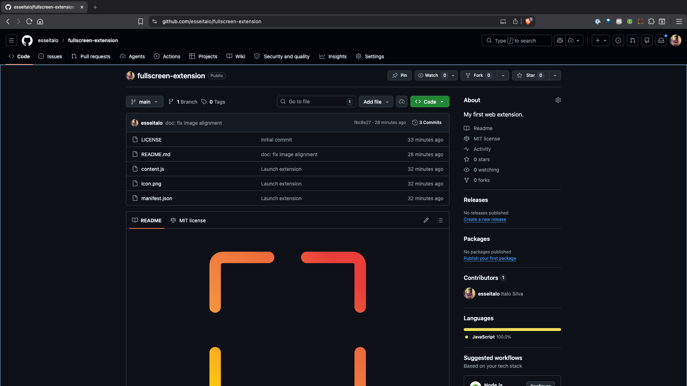
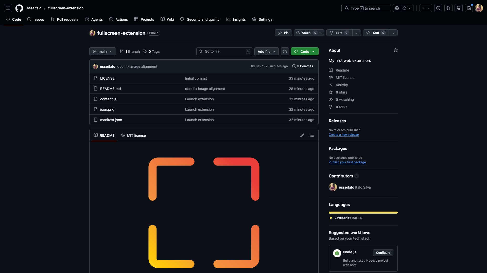

  

# Fullscreen!

My web extension to make any page in the chromium based browsers completely fullscreen.

# Problem

My macbook does not make the page fullscree when I use the shortcut `fn + f` the tabs stays on the top screen. 

  

Now with this extension, only the page is fullscreen, just like on windows devices. Just pressing `fn + cmd + F11`.

  

